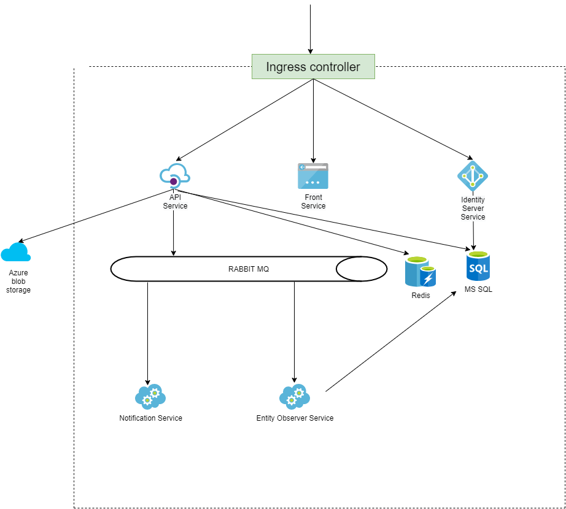
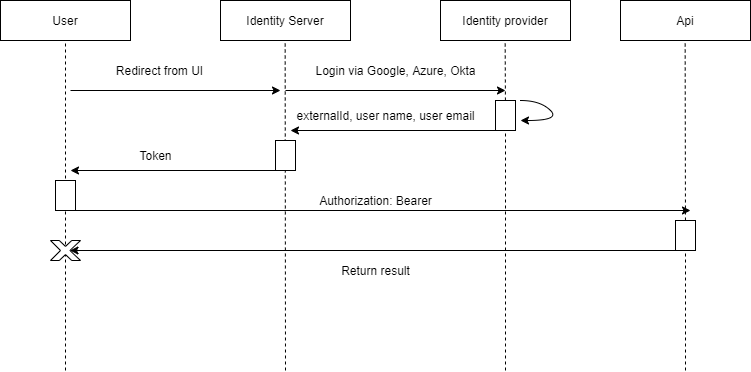
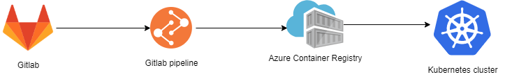

# Task manager via Dmytro Poliit

## Application architecture

### Application is designed as SOA project. Let`s view its components.

## Components
1. API - component, which handles all the incoming requests.
2. Front end
3. Identity Server - component, which is responsible for the authorization && authentication.
Authorization via implicit flow is implemented as follows

4. Redis
5. MS SQL Database
6. Enitity Observer is used to track changes and to push an event to the notification service if specific changes were made
7. Notification Service is used to notify the user of some events
8. All the images are saved to the Azure blob storage

### All of the images are build via Gitlab pipelines, pushed to the Azure Container Registry and than pulled by K8s

## Technologies
1.  .Net Core Web API
    1. Authorization w JWT and Roles
    2. Layered architecture
       1. DAL, Repository pattern
       2. Service Layer
       3. Unit of Work pattern
    3. Entity Framework
    4. SSO (implicit and credentials grant flow)
    5. Middleware
       1. Request-Response logging middleware
       2. Global error handling middleware
    6. Unit Tests
2. Containerization
   1. Docker
   2. Docker-compose
   3. CI/CD
   4. Building images and pushing to Azure Container Registry via Gitlab Pipelines
3.  Architecture
    1.  Service Oriented Architecture
    2.  RabbitMq
    3.  MassTransit
4.  Kubernetes
5.  Azure
    1.  Azure blob storage
    2.  Azure container registry
6. Other
   1. Caching (Redis)
   2. Automapper
   3. FluentValidator
   4. Frontend - SPA Angular application v8